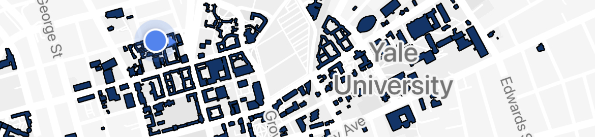

# YaleNav

### 📱 A mobile app helping **Yale** students explore and **navigate** campus seamlessly.

YaleNav is the only vertically-integrated navigation system that offers three features most critical to student life:

1. **A-to-B routing** with Yale-specific transport integration – you’ll finally know whether or not to wait for the shuttle.
2. **Dynamic visualization of campus spots** – you’ll know which butteries are near you and which dining halls are available.
3. Personalized tooling to help you **navigate your class schedule** faster than ever before.

&nbsp;

<p align="center">
<kbd>

</kbd>
</p>

&nbsp;

> ### Interested in trying the app out for yourself? 👇
>
> - **Send vincent.schaffer@yale.edu an email** –– he'll add you to our beta user group on Expo. You should get an invite via email within a few hours.
> - In the meantime, **download [Expo Go](https://apps.apple.com/us/app/expo-go/id982107779)**. Once you've successfuly joined the beta user group, **sign into the app**.
> - **Scan the QR code below, follow the link, and enjoy!** 🎉
> <p align="center">
> 
> </p>

# Development

The following repository was written as part of Yale's Software Engineering class, and contains the most updated code on which the application relies.

👊 Code authors:

- Kyle Zawadski
- Vincent Schaffer
- Graham Hardcastle
- Jonathan Yu
- Petru Neagu
- Ali Hafez

To get a sense of how we've organized the code in front- and back-end, be sure to check out the following READMEs 👇

- [Server](https://github.com/yale-swe/f22-yalenav/tree/main/server#readme)
- [Client](https://github.com/yale-swe/f22-yalenav/tree/main/client#readme)

## Stack


👨‍💻 YaleNav's software architecture is a variation of [MERN](https://www.mongodb.com/mern-stack).

- [TypeScript](https://www.typescriptlang.org/) (Programming Language)
- [React Native](https://reactnative.dev/) (Client-side Framework)
- [Node.js](https://nodejs.org/en/) (Server-side Runtime)
- [Express](https://expressjs.com/) (Server-side Framework)
- [MongoDB](https://www.mongodb.com/home) (NoSQL Database)
- [Expo](https://expo.dev/) (Mobile App Platform)

## CI/CD

No likes a broken app. We've configured [Github Actions](https://github.com/yale-swe/f22-yalenav/actions) to automatically run tests (linting, `server` tests ,and `client` tests) on every PR and every commit to main.

## Quick start – 6 step set-up

Running this app locally requires the following technologies:

- [Docker Desktop](https://www.docker.com/products/docker-desktop)
- [Node v16.14](https://nodejs.org/en/)
- [Yarn](https://classic.yarnpkg.com/lang/en/docs/install/)
- [Expo Go](https://expo.dev/client)

> **Note**: The following won't work without first installing the above!

1. Clone the repo with `git clone https://github.com/yale-swe/f22-yalenav.git`

2. Run `yarn install:all` in the root directory (`f22-yalenav`). This will install all of the necessary npm packages.

3. In `client/src/constants.ts` change the IP address from the default (our DigitalOcean) to your own. You can find your IP in [system preferences](https://discussions.apple.com/thread/8421538) (or, alternatively on Mac, hold `Ctrl + Option` and click on the wifi icon at the top of your screen.) For an IP like `123.45.789.0`, the `BACKEND` look like this:

```
export const BACKEND = "http://123.45.789.0:4000";
```

4. Open a _first_ terminal window and run `yarn dev:env`. This will run a MongoDB container on your local machine. Keep this terminal open.

5. Open a _second_ (and final) terminal window and run `yarn dev:server`. This will run the REST API on port `4000`.

6. Open a _third_ (and final) terminal window. Run `yarn dev:client`. This will serve the client on your IP address (this is why we changed the `BACKEND` constant above) using [Expo Go](https://expo.dev/accounts/yalenav). From there you'll get to choose whether you'd like to run it on web, iOS, or Android simulators. This app will only work on iOS and Android. **We recommend that you simply scan the QR code provided in the terminal and run the app straight on your phone**.

After you run these 6 steps, your IDE (if you use one) should look something like this...

</kbd>
<p align="center">

</p>
</kbd>

# Acknowledgements

YaleNav makes use of the following third-party tools / APIs:

- [Passport CAS](https://github.com/yale-swe/passport-cas) –– for authentication and Yale student log in.
- [Yalies.io](https://yalies.io/apidocs?) –– for developer-friendly interfaces when handling user information.
- [DoubleMap](https://yaleshuttle.doublemap.com/map/) –– for shuttle routing, as presented in DoubleMap.
- [Coursetable](https://www.coursetable.com/api) –– for student courses, as well corresponding course location codes.
- [Yale Buildings (Buildings V2)](https://developers.yale.edu/buildingsv2) –– for location code translations, descriptions, and addresses.
- [Yale Maps](https://map.yale.edu/?id=1910) –– for information on locations of printers, dining halls, butteries, etc. and their operating status (Open / Closed).
- [React Native Maps](https://github.com/react-native-maps/react-native-maps) –– for general routing from your location, as well as responsive and dynamic map rendering.

# Disclaimer

This is a W.I.P.! Any suggestions for improvement? [Please submit an issue](https://github.com/yale-swe/f22-yalenav/issues).
